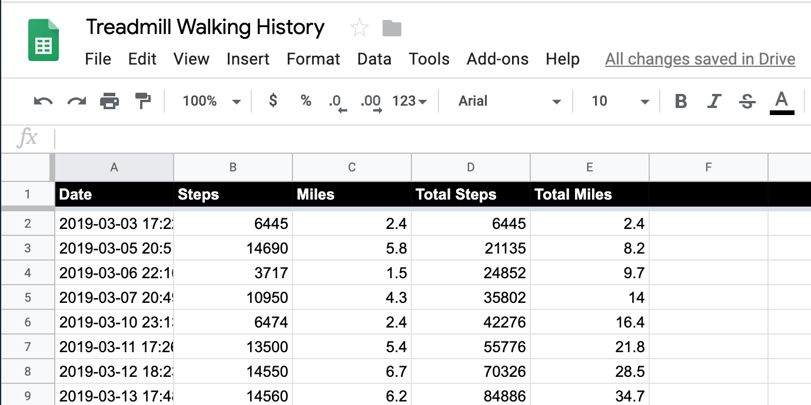
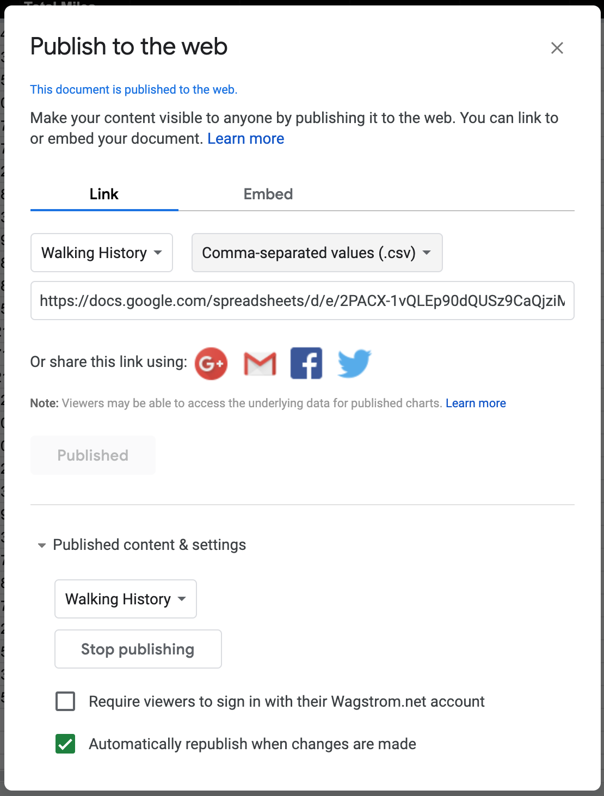
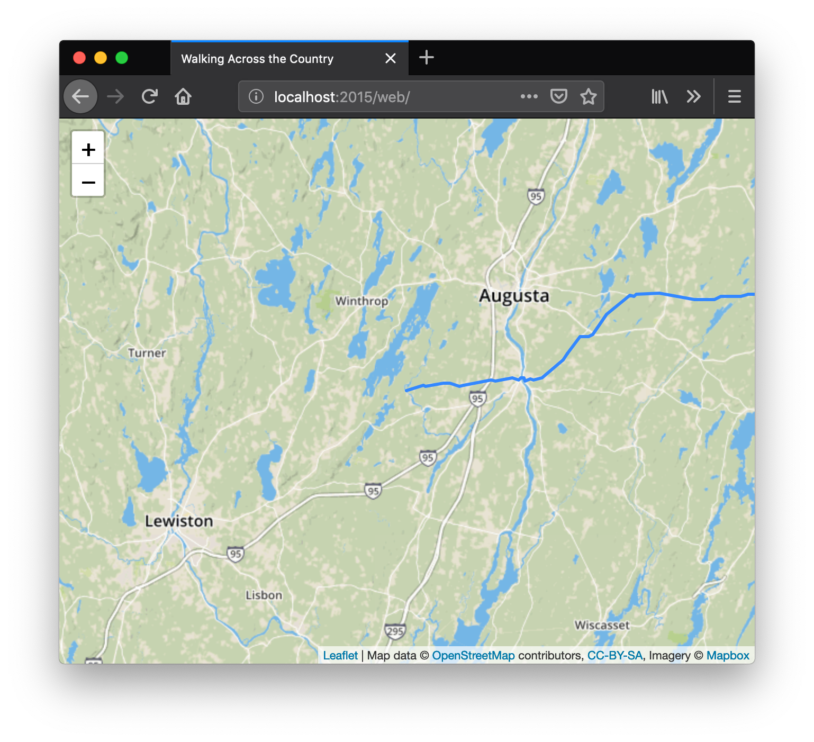

Just Walking
============

Patrick Wagstrom<br/>
April 2019

For almost a decade I've been working at a standing desk. At first I found it rather challenging, particularly when I was moving between locations and meetings and sitting down frequently. However, for the last two and a half years I've had a lot better opportunity to work full time at the standing desk. In general this keeps me more awake and more attentive during meetings. However, I still found myself gaining weight. Earlier this year I decided it was time to up the level of my standing desk and add in a treadmill.

Challenges are extremely motivating to me and just walking wasn't all that great. After a few days I started to track my walking within Apple Health thanks to a custom shortcut. But this just gave me daily graphs. What if you want more? What if you want to know how far you've gone in walking across your home state, country, or even a continent? That's where this script comes in!

In short, given walking history in a Google Spreadsheet (or other CSV that you
can fetch from a browser) and a route, this will plot your progress on a map. It's a fun and interesting way to measure your progress.

Things Needed
-------------

1. A KMZ file with your walking route. You can create one of these using [Google My Maps](google-my-maps).
2. A spreadsheet that is published on the web that contains your walking history. I use a [Google Sheets sheet to track my walking](google-sheet-walking) that is automatically published to the web as a CSV after every change.
3. A key to use [MapBox](mapbox).

### Creating and Extracting your KMZ File

You can use whatever tool you want to generate your KMZ route, but using Google My Maps is what I used. There's a good chance that my code is a little particular toward the format they use. If you want, you can skip the step of creating your own my by using the map that I have that takes you from the furthest east point in the Lower 48 of the United States (West Quoddy Lighthouse outside of Lubec, Maine) to the furthest west point (Cape Avala, Washington). You can find that in the `python` directory as `Directions from West Quoddy Head Lighthouse, South Lubec Road, Lubec, ME, USA to Cape Alava, Washington, USA.kmz`.

Unfortunately, KMZ files are XML, which means that processing them is a pain in JavaScript. Also, there's some elements like distances that aren't included the KMZ file. To make it easier to work with in your browser, within the python directory is `dataprep.py`. This will convert the path into a JSON lines file that can be easily read into a browser.

There are also a few dependencies of this library, namely [GeoPy](geopy) for processing coordinates and [lxml](lxml) to make parsing XML slightly less terrible. If you're impatient with all this and just want to get the JSON Lines file needed for the web page, run the following commands:

```bash
cd python
pip install geopy
pip install lxml # if you're in Conda you can use conda install instead
python dataprep.py "Directions from West Quoddy Head Lighthouse, South Lubec Road, Lubec, ME, USA to Cape Alava, Washington, USA.kmz" ../web/walkingPath.jsonl
```

### Prepping Your Spreadsheet

I track all of my walking within Google Sheets. I've got a nice little iOS shortcut that I created that both adds my walking history into Apple Health and posts it against this spreadsheet which gets automatically updated.

You'll want five columns with the names as specified in the screenshot below. Sorry to people who use real measurement systems, but my brain is broken and thinks in terms of miles.



The only change that I did is that I changed the formatting on the Date column to be something that Javascript's `Date` objects can more easily parse. There's also forumlas in there, but you should be able to figure out.

Once you're happy, you want to publish just that sheet of your spreadsheet to the web. You can do this by selecting "File->Publish to the Web...". Select only the main sheet, set the format to CSV, and automatically republish whenever changes are made.



Take note of the URL, you're going to need it to set up your `config.js` script.

### Managing Your Keys

Next, you'll need an account for MapBox. Yes, this means you're going to end up paying money if your walking map gets the Hacker News hug of death, but such are the tradeoffs if you want high quality maps.

Within MapBox I suggest creating a key for just this application. The only scopes you need are `Styles:Tiles` and `Styles:Read`. If you want to get really fancy, you can also specify that the key can only work from a small subset of domains. That may not be a bad idea, but just remember, some really privacy focused people don't send out the referrer header, which breaks this functionality.

Now, go into `web/config.js` and enter in both of the values into the settings within that file.

### Testing it All Out

If everything went well to this point, you should be golden. There's no magic server side component to make this work. You can open it in a simple single page browser, or copy the contents of the `web` directory to someplace on your server and your walking path will be automatically updated as you record more data into your spreadsheet. The CSS applied to the sheet should make it so you can easily embed it into another page using an `iframe`.



[google-my-maps]: https://www.google.com/maps/d/u/0/
[mapbox]: https://www.mapbox.com/
[google-sheet-walking]: https://docs.google.com/spreadsheets/d/e/2PACX-1vQLEp90dQUSz9CaQjziMQ60UKZZVXfc2QlbrIEn7qJrgKalO9IiY_OfZiITEGECU_c0RdvnEjgraGiC/pubhtml?gid=0&single=true
[geopy]: https://github.com/geopy/geopy
[lxml]: https://lxml.de/tutorial.html